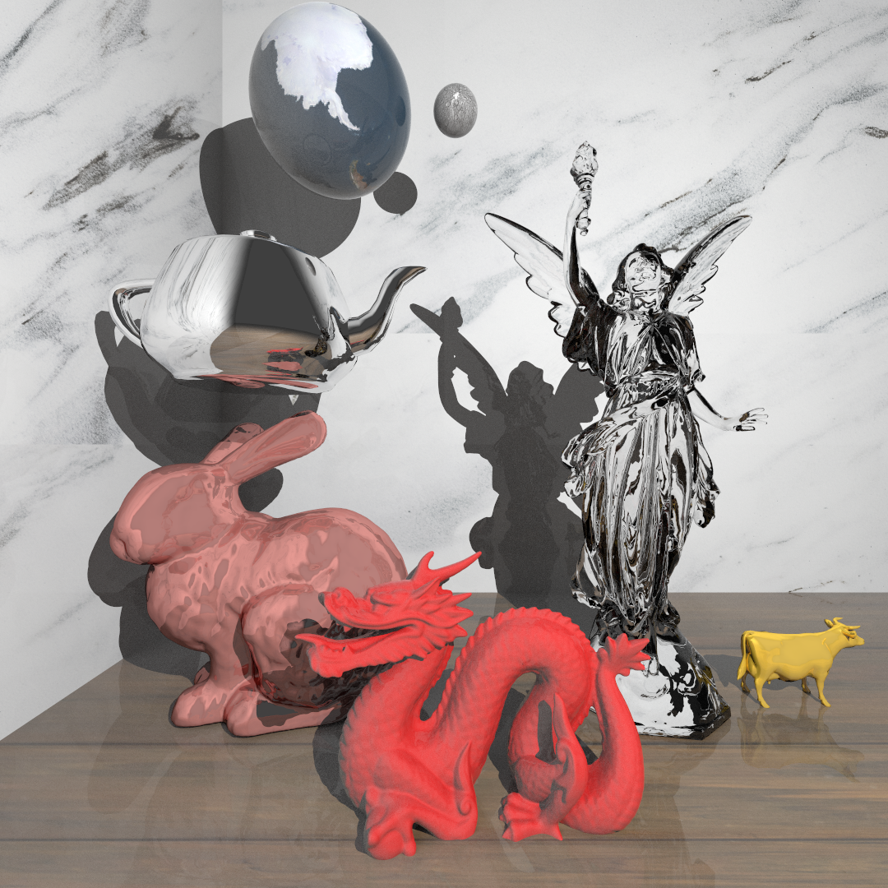

# Description
## This project uses Make and clang++ with C++17.

I originally started this project as a fun exercise for myself following some guidelines from a 4 credit hour assignment in a class I took for 3 credit hours, UIUC CS 418: Interactive Computer Graphics.

The format of the scene files can be found [here](https://cs418.cs.illinois.edu/website/hw-raytracer.html) on the course site.

Note that Version 2 is transitioning away from the txt-based scene files while integrating a custom format that can be found in [FileFormat.md](FileFormat.md). While some functionality still works with the original scene files, most has shifted to a different model of rendering.

If you want to create your own scenes, you can either follow the original txt format above, or create scenes following the sdml format in [FileFormat.md](FileFormat.md). Examples of both formats can be found in <b>example_scenes/scene_files</b>. Note that all functionality listed in FileFormat.md will work wheras some functionality in txt files like <b>gi</b> won't work. I do not have a comprehensive list of the working parts, so I recommend using sdml as this will be the supported format going forward.

Benchmarks from Version 1 can be found in benchmarks. This includes rendering times with Bounding Volume Hierarchy acceleration and multi-threading.

If you would like to play around with this project, use the following commands
```
git clone [this repository]
cd [this repository]
make
./raytracer [-t numThreads] filepath
```

Any feedback or issues found are very much welcome, as well as additional contributors! TODOs are found in [TODO.md](TODO.md) and will be revised regularly. The <b>dev</b> branch will be used to organize small updates and fixes. Version changes will be reserved for major changes that break backwards compatibility or introduce a suite of new features. Version branches will hopefully be up soon, and [TODO.md](TODO.md) will reflect this separation of concerns.

# Example Scene

4 minute 17.61 second 1080 by 1080 render using M1 Macbook Pro with 8 threads on 1 environment light, 1 point light, 1,048,897 objects + 3 planes, and 256 rays per pixel. Credits to <a href="https://www.freepik.com/free-photo/close-up-black-marble-textured-background_3472377.htm#query=marble%20texture&position=0&from_view=keyword">marble by rawpixel.com</a> and <a href="https://www.freepik.com/free-photo/wooden_1175802.htm#query=wood%20floor%20texture&position=8&from_view=keyword">wooden by evening_tao</a> on Freepik for the textures, and credits to [alecjacobson's 3D modeling repository](https://github.com/alecjacobson/common-3d-test-models) for the obj files.
